## Building Desktop Application with Web Technologies

Presenter: Sam <!-- .element: style="font-size: 30px" -->

 <!-- .element width="300px" -->

----

#### Contenders
 <!-- .element class="fragment" width="200px" -->
 <!-- .element class="fragment" width="200px" -->
 <!-- .element class="fragment" width="250px" -->

---

<!-- .slide: data-background-color="#1f1f1f" -->

### Prerequisites

----

<!-- .slide: data-background-color="#1f1f1f" -->

Definition: **Browser Engine**

> A browser engine (also known as a layout engine or rendering engine) is a core software component of every major web browser. The primary job of a browser engine is to transform HTML documents and other resources of a web page into an interactive visual representation on a user's device. <!-- .element: style="font-size: 32px; line-height: 1.5; word-spacing: 3px;" -->

----

<!-- .slide: data-background-color="#1f1f1f" -->

Definition: **Webview**

> WebView is an Embedded user-agent and typically a web browser UI component that can be embedded in apps to render web pages. <!-- .element: style="font-size: 32px; line-height: 1.5; word-spacing: 3px;" -->

---

<!-- .slide: data-background-color="#1a2641" -->

### Electron

 <!-- .element width="300px" -->

----

<!-- .slide: data-background-color="#1a2641" -->

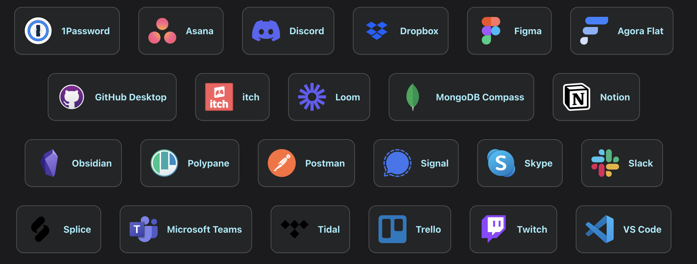 <!-- .element width="1000px" -->

----

<!-- .slide: data-background-color="#1a2641" -->

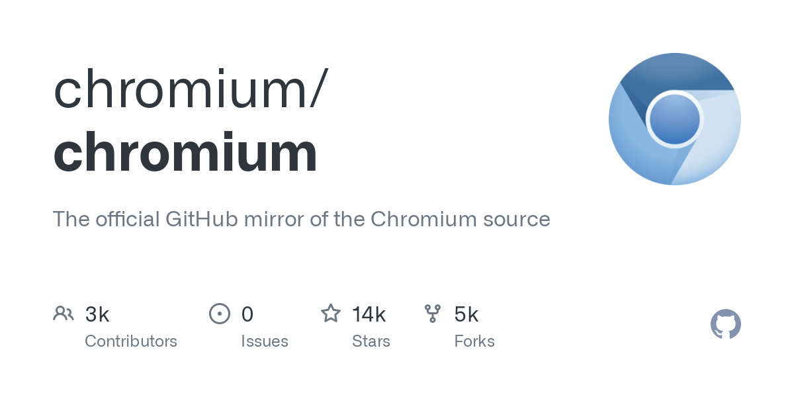 <!-- .element height="250px" -->
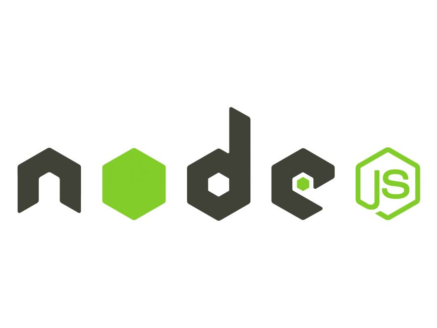 <!-- .element height="250px" -->

Chromium (webview) + NodeJS (backend) <!-- .element: style="font-size: 38px;" -->

----

<!-- .slide: data-background-color="#1a2641" -->

#### Process Model

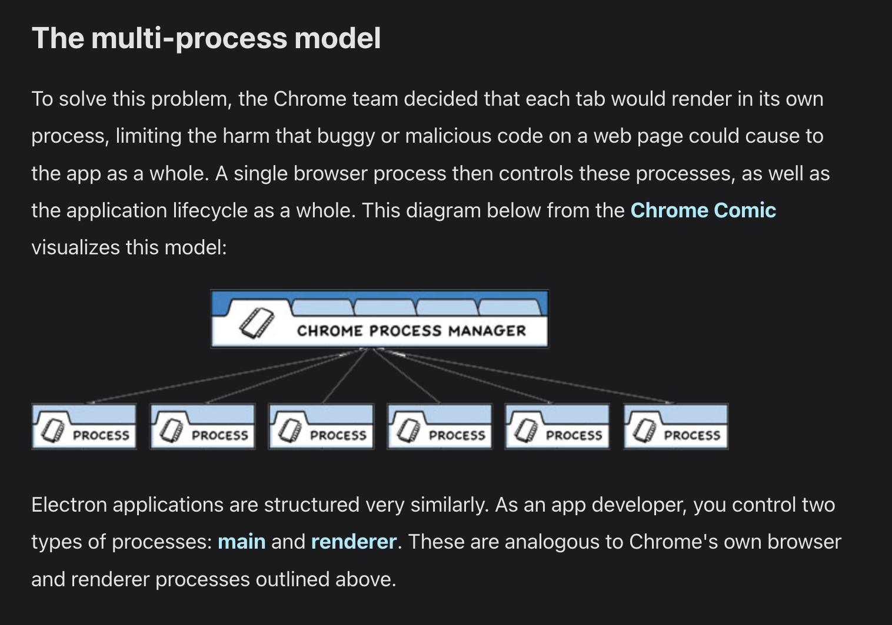 <!-- .element width="800px" -->

----

<!-- .slide: data-background-color="#1a2641" -->

#### Main Process

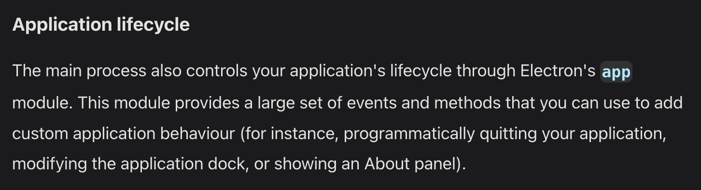 <!-- .element width="750px" -->

#### Renderer Process

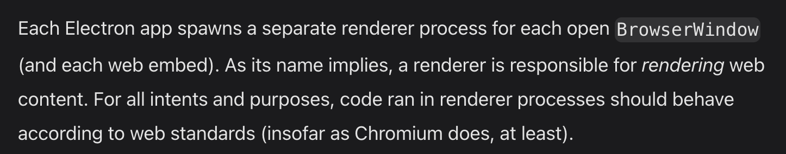 <!-- .element width="750px" -->

But wait, there is a catch... <!-- .element: class="fragment" style="font-size: 28px;" -->

----

<!-- .slide: data-background-color="#1a2641" -->

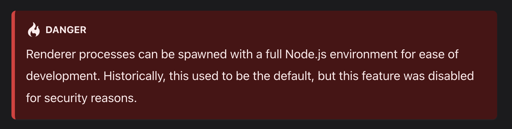

So how could the renderer be able to leverage the power of Node and Electron? <!-- .element: class="fragment" style="font-size: 28px;" -->

----

<!-- .slide: data-background-color="#1a2641" -->

#### Preload Scripts

Come to the rescue... <!-- .element: style="font-size: 24px;" -->

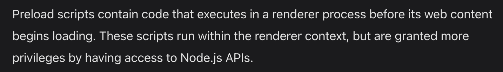

```js
// preload.js

const { contextBridge } = require('electron')

contextBridge.exposeInMainWorld('myAPI', {
  desktop: true,
})
```
<!-- .element: class="fragment" style="font-size: 18px;" -->

```js
// renderer.js

console.log(window.myAPI)  // => { desktop: true }

```
<!-- .element: class="fragment" style="font-size: 18px;" -->

----

<!-- .slide: data-background-color="#1a2641" -->

But what if I just want to keep API internal to main process...? <!-- .element: style="font-size: 45px; word-spacing: 3px;" -->

----

<!-- .slide: data-background-color="#1a2641" -->

#### `ipcRenderer` & `ipcMain`

are what you need... <!-- .element: style="font-size: 24px;" -->

```js
// renderer.js

ipcRenderer.send('myChannel', ...args)
```
<!-- .element: class="fragment" style="font-size: 20px; line-height: 1.5;" -->

```js
// main.js

ipcMain.on('myChannel', (...args) => {
  // Do stuff...
})
```
<!-- .element: class="fragment" style="font-size: 20px; line-height: 1.5;" -->

and that's it... <!-- .element: class="fragment" style="font-size: 24px;" -->

---

<!-- .slide: data-background-color="#2f2517" -->

### Tauri

 <!-- .element width="300px" -->

----

<!-- .slide: data-background-color="#2f2517" -->

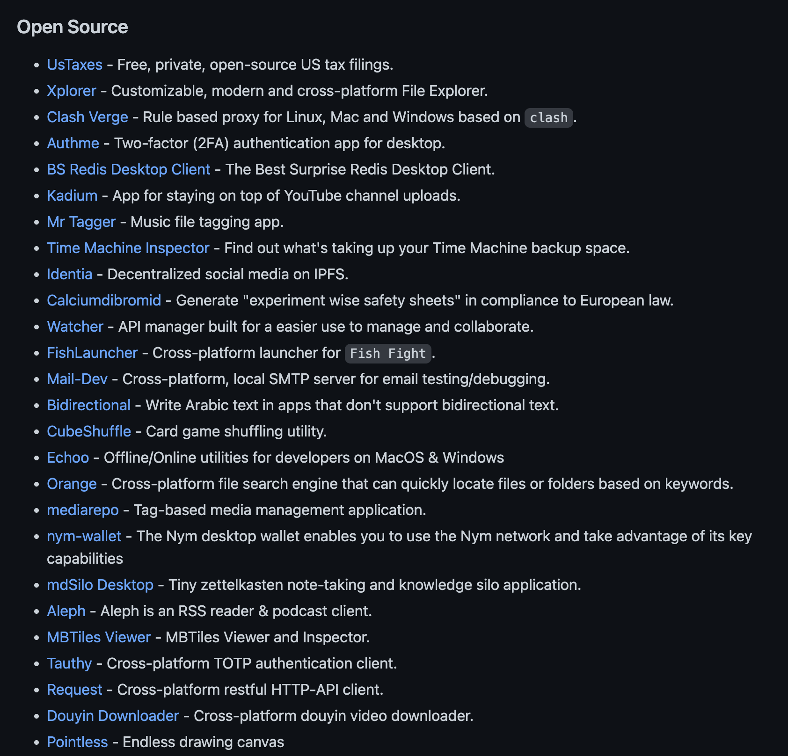 <!-- .element: width="800px" -->

Notes:
- [xplorer](https://github.com/kimlimjustin/xplorer)
- [orange](https://github.com/naaive/orange)
- [Time machine inspector](https://github.com/probablykasper/time-machine-inspector)

----

<!-- .slide: data-background-color="#2f2517" -->

#### Tao

Crossplatform application windowing library <!-- .element: style="font-size: 28px;" -->

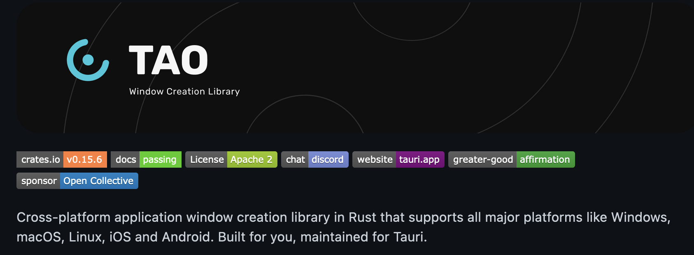

Tauri actually uses something else for Linux currently... <!-- .element: class="fragment" style="font-size: 24px;" -->

----

<!-- .slide: data-background-color="#2f2517" -->

#### WRY

Webview rendering library

Usng WebKit, WebView2, WebViewGTK, ... <!-- .element: style="font-size: 24px;" -->

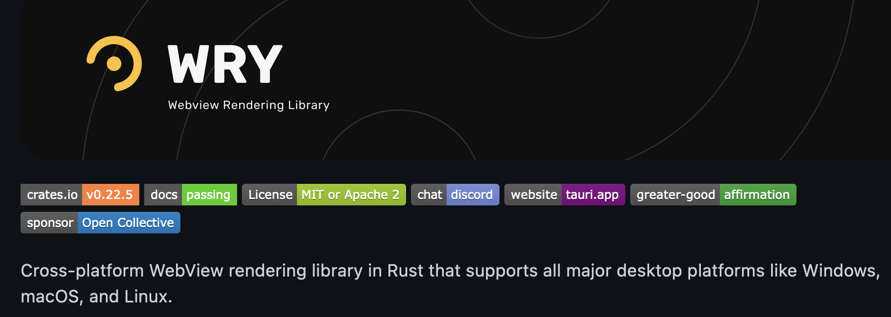

Why not use Chromium? <!-- .element: class="fragment" style="font-size: 24px;" -->

----

<!-- .slide: data-background-color="#2f2517" -->

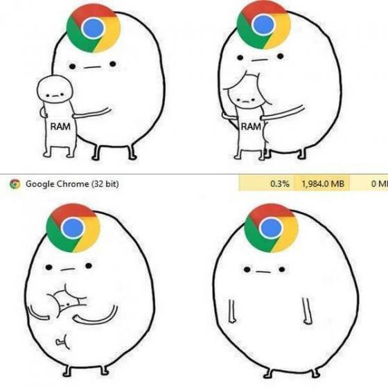

----

<!-- .slide: data-background-color="#2f2517" -->

Ok... but what about its backend? <!-- .element: style="font-size: 32px;" -->

----

<!-- .slide: data-background-color="#2f2517" -->

#### Rust


----

<!-- .slide: data-background-color="#2f2517" -->

Compiled to binary, unlike NodeJS. Expect 1000x performance. <!-- .element: style="font-size: 28px;" -->


---

<!-- .slide: data-background-color="#2d1414" -->

### Wails

 <!-- .element width="600px" -->

---

### Developer Experience

 <!-- .element height="280px" -->
 <!-- .element height="280px" -->

----

<!-- .slide: data-background-color="#2f2517" -->

#### Tauri

 <!-- .element height="250px" -->
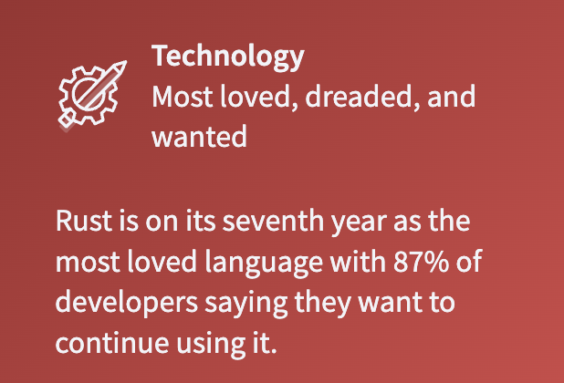 <!-- .element height="250px" -->

----

<!-- .slide: data-background-color="#2d1414" -->

#### Wails

----

<!-- .slide: data-background-color="#1a2641" -->

#### Electron

---

 <!-- .element height="500px" -->