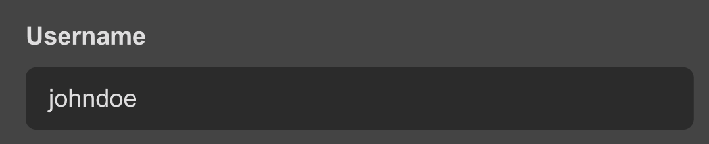
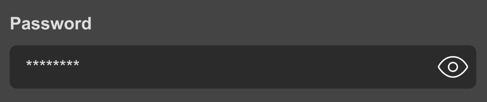
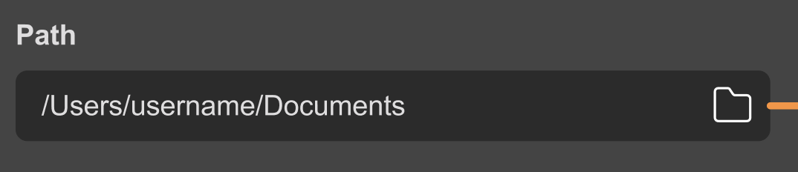
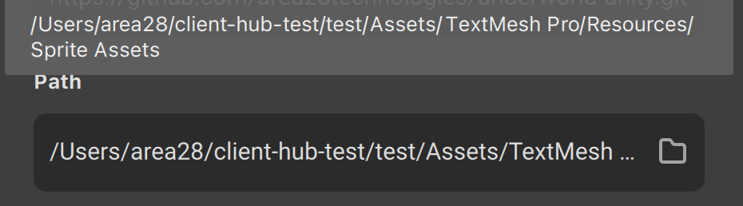
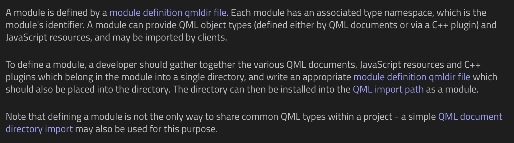
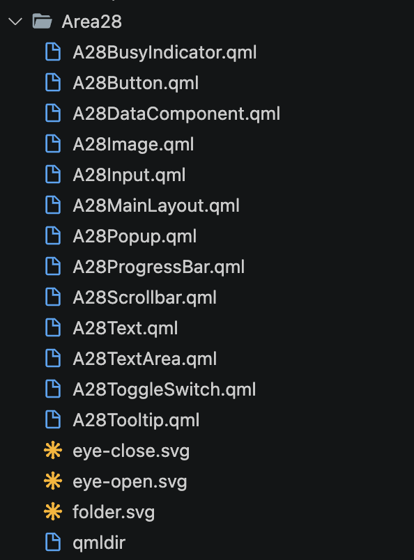
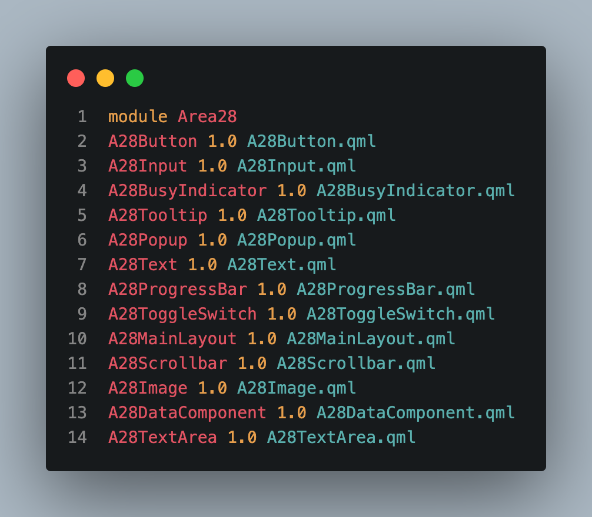
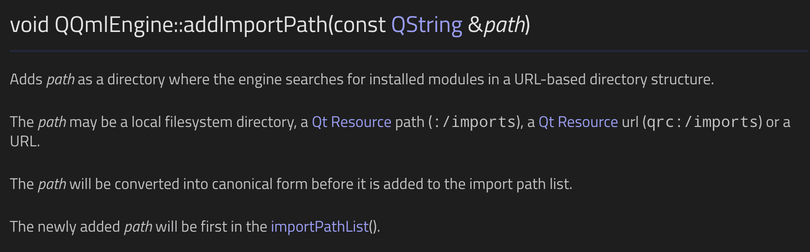
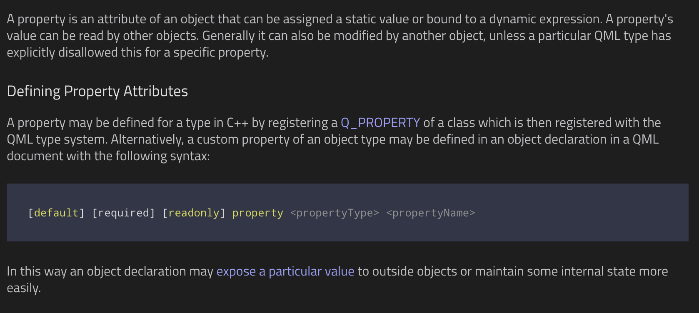

## UI Component Design in Qml

Presenter: Sam <!-- .element: style="font-size: 30px" -->

 <!-- .element width="300px" -->

----

What is "*good UI component design*"? <!-- .element: style="font-size: 36px" -->

- Self-contained <!-- .element: class="fragment" style="font-size: 30px; word-spacing: 3px; line-height: 1.5;" -->
- Well-defined abstraction <!-- .element: class="fragment" style="font-size: 30px; word-spacing: 3px; line-height: 1.5;" -->
- Modularised <!-- .element: class="fragment" style="font-size: 30px; word-spacing: 3px; line-height: 1.5;" -->
- Encapsulated <!-- .element: class="fragment" style="font-size: 30px; word-spacing: 3px; line-height: 1.5;" -->
- Separation of concern <!-- .element: class="fragment" style="font-size: 30px; word-spacing: 3px; line-height: 1.5;" -->
- Declarative interface <!-- .element: class="fragment" style="font-size: 30px; word-spacing: 3px; line-height: 1.5;" -->
- Isolated <!-- .element: class="fragment" style="font-size: 30px; word-spacing: 3px; line-height: 1.5;" -->
- Resuable <!-- .element: class="fragment" style="font-size: 30px; word-spacing: 3px; line-height: 1.5;" -->
- and so on... <!-- .element: class="fragment" style="font-size: 30px; word-spacing: 3px; line-height: 1.5;" -->

Basically **React components** <!-- .element: style="color: #2b79cd" -->...
<!-- .element: class="fragment" style="font-size: 30px" -->

---

I will just give you an example... <!-- .element: style="font-size: 30px" -->

 <!-- .element: class="fragment" width="450px" -->
 <!-- .element: class="fragment" width="450px" -->
 <!-- .element: class="fragment" width="450px" -->
 <!-- .element: class="fragment" width="450px" -->

And we want to cater all of these cases... <!-- .element: class="fragment" style="font-size: 30px;" -->

----

<!-- .slide: data-auto-animate -->

What would the *ideal*<!-- .element: style="color: #2b79cd" --> interface looks like?
<!-- .element: style="font-size: 34px; word-spacing: 3px; line-height: 1.5;" -->

<!-- Cannot get code transition to work with reveal markdown ;( -->
<!-- https://github.com/hakimel/reveal.js/issues/3041 -->

```qml[1-8|9-16|17-24]
// In some Qml file

import Area28

A28Input {
  type: Text
}

// In some other Qml file

import Area28

A28Input {
  type: Password
}

// In some other other Qml file

import Area28

A28Input {
  type: File
}
```
<!-- .element: class="fragment" style="font-size: 20px; line-height: 1.5;" -->

----

But how do we need to make this happen...? <!-- .element: style="font-size: 34px; word-spacing: 3px; line-height: 1.5;" -->

1. Qml Module <!-- .element: class="fragment" style="font-size: 34px; word-spacing: 3px; line-height: 2; color: #58b577;" -->
2. Qml Property <!-- .element: class="fragment" style="font-size: 34px; word-spacing: 3px; line-height: 2;color: #a25bc1;" -->
3. Qml Enum <!-- .element: class="fragment" style="font-size: 34px; word-spacing: 3px; line-height: 2; color: #b9935b;" -->

---

<!-- .slide: data-background-color="#213127" -->

### Qml Module
The central piece of the puzzle... <!-- .element: style="font-size: 30px; word-spacing: 3px; line-height: 2;" -->

----

<!-- .slide: data-background-color="#213127" -->



Things to pay attention to... <!-- .element: class="fragment" style="font-size: 30px; word-spacing: 3px; line-height: 2;" -->
- "qmldir file" <!-- .element: class="fragment" style="font-size: 28px; word-spacing: 3px; line-height: 1.5; font-style: italic;" -->
- "single directory" <!-- .element: class="fragment" style="font-size: 28px; word-spacing: 3px; line-height: 1.5; font-style: italic;" -->
- "Qml import path" <!-- .element: class="fragment" style="font-size: 28px; word-spacing: 3px; line-height: 1.5; font-style: italic;" -->

----

<!-- .slide: data-background-color="#213127" -->

#### single directory

 <!-- .element: width="350px" -->

----

<!-- .slide: data-background-color="#213127" -->

#### `qmldir` file

Module definition file <!-- .element: style="font-size: 30px; word-spacing: 3px; line-height: 2;" -->

 <!-- .element: width="500px" -->

----

<!-- .slide: data-background-color="#213127" -->

#### Qml import path

We want to add our module to the Qml import path... <!-- .element: style="font-size: 28px; word-spacing: 3px; line-height: 2;" -->



----

<!-- .slide: data-background-color="#213127" -->

And after all that is done...</br>We now go make our custom input component pretty...<!-- .element: style="font-size: 30px; word-spacing: 3px; line-height: 2;" -->

```qml
// Inside A28Input.qml

Input {  // Inherit from Qml's Input component
  // Some fancy styles...
}
```
<!-- .element: class="fragment" style="font-size: 20px; line-height: 1.5;" -->

And we can finally starting using our custom input component *EVERYWHERE*
<!-- .element: class="fragment" style="font-size: 28px; word-spacing: 3px; line-height: 2;" -->

```qml
import Area28 1.0

A28Input {}
```
<!-- .element: class="fragment" style="font-size: 20px; line-height: 1.5;" -->

---

<!-- .slide: data-background-color="#2e2131" -->

### Qml Property
Makes our interface nice to work with... <!-- .element: style="font-size: 30px; word-spacing: 3px; line-height: 2;" -->

----

<!-- .slide: data-background-color="#2e2131" -->



*"expose a particular value to outside objects"* <!-- .element: style="font-size: 30px; word-spacing: 3px; line-height: 2;" -->

----

<!-- .slide: data-background-color="#2e2131" -->

How does this help? You may ask... <!-- .element: style="font-size: 30px; word-spacing: 3px; line-height: 2;" -->

Let's recall our *"ideal interface"*
<!-- .element: class="fragment" style="font-size: 30px; word-spacing: 3px; line-height: 2;" -->

```qml
// In some Qml file

import Area28

A28Input {  // A28Input inherits from Qml's Input component
  type: Text  // Pay attention that we are using the "type" attribute
}
```
<!-- .element: class="fragment" style="font-size: 20px; line-height:1.5;" -->

But Qml's `Input` object doesn't have a `type` attribute by default...
<!-- .element: class="fragment" style="font-size: 28px; word-spacing: 3px; line-height: 2;" -->

----

<!-- .slide: data-background-color="#2e2131" -->

So we create a `type` field!!! Using Qml property
<!-- .element: style="font-size: 30px; word-spacing: 3px; line-height: 2;" -->

```qml[4|23|31|39]
// Inside A28Input.qml

Input {
    property string type

    color: {
      switch(type) {
        case "text":
          return "white";
        case "file":
          return "blue";
        case "password":
          return "red";
      }
    }
}

// We can make it a text input

import Area28 1.0

A28Input {
  type: "text"
}

// Or we can make it a file input

import Area28 1.0

A28Input {
  type: "file"
}

// Or we can make it a password input

import Area28 1.0

A28Input {
  type: "password"
}
```
<!-- .element: class="fragment" style="font-size: 18px; line-height: 1.3;" -->

---

<!-- .slide: data-background-color="#312b21" -->

### Qml Enum

The cherry on top... <!-- .element: style="font-size: 30px; word-spacing: 3px; line-height: 2;" -->

----

Using `string` doesn't enforce what value can the `type` attribute takes</br>So we use enum
<!-- .element: style="font-size: 30px; word-spacing: 3px; line-height: 2;" -->

<!-- .slide: data-background-color="#312b21" -->

```qml[4-8|29|37|45]
// A28Input.qml

Input {
    enum Type {
        Password,
        File,
        Text
    }

    property int type

    color: {
      switch(type) {
        case A28Input.Type.Text:
          return "white";
        case A28Input.Type.File:
          return "blue";
        case A28Input.Type.Password:
          return "red";
      }
    }
}

// We can make it a text input

import Area28 1.0

A28Input {
  type: A28Input.Type.Text
}

// Or we can make it a password input

import Area28 1.0

A28Input {
  type: A28Input.Type.Password
}

// Or we can make it a file input

import Area28 1.0

A28Input {
  type: A28Input.Type.File
}
```
<!-- .element: style="font-size: 16px; line-height: 1.3;" -->

---

 <!-- .element width="500px" -->